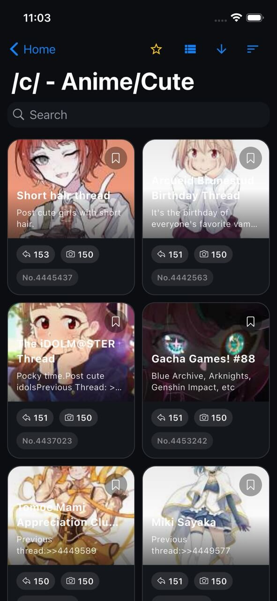
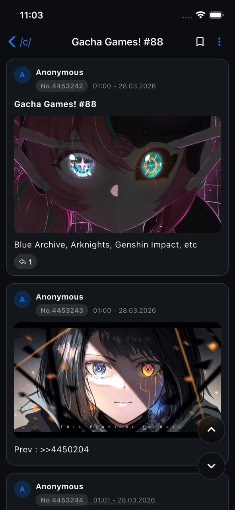

# NekoSurf

NekoSurf is a fast, privacy-friendly 4chan viewer built with Flutter for iOS and Android.

It is designed for smooth browsing with modern card-based layouts, media-first navigation, and practical quality-of-life tools for everyday use.

## Features

### Browsing

- Browse all boards with fast search
- Open threads directly from pasted 4chan links
- Switch board threads between grid and list view
- Sort threads by bump order, newest, oldest, reply count, or image count
- Choose default board view, sort mode, and sort direction in settings

### Bookmarks and Favorites

- Favorite boards for quick access on the home screen
- Bookmark threads for later with status tracking
- See archived/deleted state on bookmarked threads

### Media Experience

- Optimized image and video browsing
- WebM/MP4 playback support
- Save attachments locally and revisit them in a dedicated saved media viewer
- Share saved media directly from inside the app
- Download media to gallery/photos

### Privacy and Personalization

- Dark mode support
- NSFW board visibility toggle
- Auto-scroll to last seen post
- Watched posts retention controls
- Cache size display and one-tap cache cleanup

## Screenshots

  
  

### Gallery

## TestFlight

Try NekoSurf on iOS via TestFlight: [https://testflight.apple.com/join/ky5bRwMY](https://testflight.apple.com/join/ky5bRwMY)

## License

Distributed under the GPL-3.0 license. See [LICENSE](https://github.com/NekoSurf/NekoSurf/blob/develop/LICENSE) for details.
